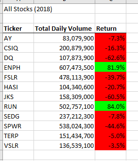
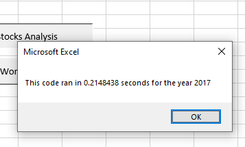
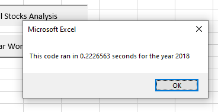

# Stock Analysis with VBA

## Overview of Project
This project aims to refactor a VBA code to improve its performance. The script purpose was to analyze a dataset containing green energy stocks information to help an investor identify stocks with better results within the years of 2017 and 2018.

## Results 
Results will be divided into two categories, stock performance and execution times. The first category will focus on the data collected and interpreted using the VBA script. The second one will present the changes in processing times once the refactored code is applied. The Excel file can be found on [VBA_Challenge.xlsm]( VBA_Challenge.xlsm) and the VBA Script is available on [VBA_Challenge.vbs](VBA_Challenge.vbs).

### Stock performance
As can be seen in the tables below, 2017 was a better year to invest in the green stock market. Only the company identified by the ticker TERP registered a loss on the period, and nine over twelve companies had a return higher than 20%, with special attention to DQ, ENPH, FSLR, and SEDG with return percentages above 100%. In 2018, only two stocks remain profitable, FSLR and SEDG, even the margin of return decreased considerably for both. Still, they are the most likely to give a positive return in the following year. Still, it is important to mention that stock is a high-risk option of investment, therefore there is no guarantee of profit.

  

  
### Execution times
The images below show the running times before applying the refactored code. The original script takes around one second to execute the algorithm.

    

The new script improved performance by reducing the running time to 0.2 seconds, which means the new code is more efficient than the previous version. 

    

## Summary
Refactoring a code has many advantages. As mentioned before, one advantage is to improve performance. A more efficient algorithm requires fewer steps to achieve a goal. In this project, the original script would use a nested loop to read all values for a particular ticker, write the calculations in the results sheet, then repeat the steps for the next ticker. The new version also uses a nested loop, but instead of writing them in the results table immediately, values are stored in arrays. After finishing reading all rows, results are printed in the proper sheet, avoiding activating both data and results worksheets multiple times.
Another advantage is to improve readability, helping other developers to follow the steps on the script. This is done by declaring variables and functions with meaningful names as well as adding comments that state what is the purpose of each part of the code.
